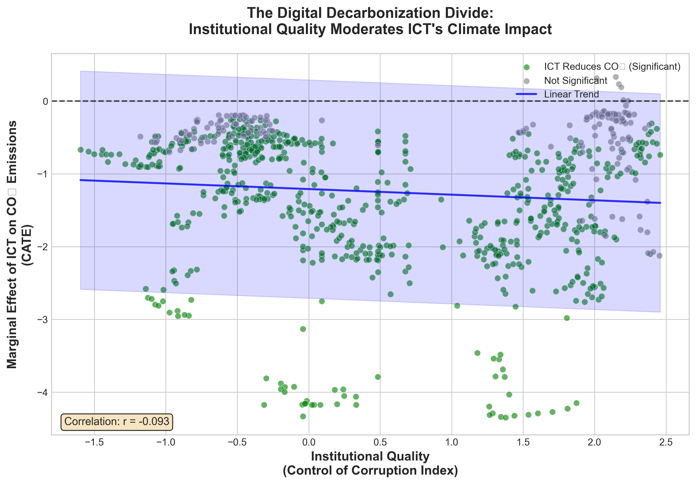
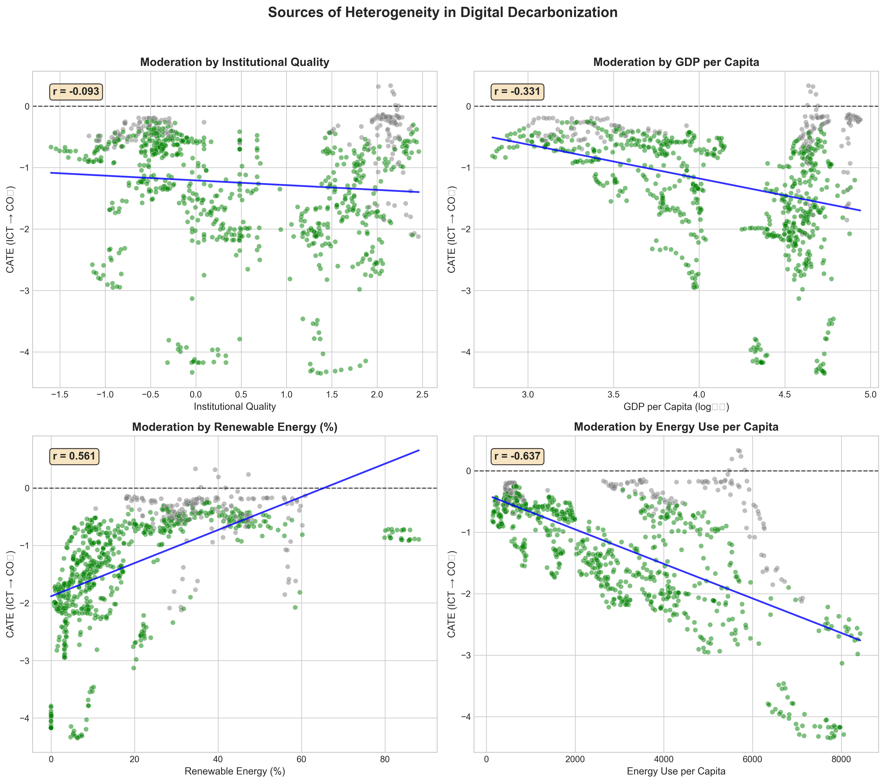

# The Digital Decarbonization Divide (Replication Package)

This repository contains the data and code to reproduce the findings of the paper:
**"The Digital Decarbonization Divide: Asymmetric Effects of ICT on CO₂ Emissions Across Socio-economic Capacity"**

## 🔑 Key Findings

Using a **Causal Forest DML** framework on 960 observations across 40 economies:

| Finding | Value |
|---------|-------|
| Pointwise significant estimates | **25.3%** (uncorrected) |
| CATE range | −0.10 to +0.04 metric tons/capita |
| Negative point estimates | 95.7% of observations |
| CATE × GDP per capita | r = −0.55 (strongest descriptive) |
| CATE × Institutional Quality | r = −0.40 |
| GDP Interaction p-value | **< 0.001** (OLS; standard SE) |

### The Core Insight: A "Divide" Exists

- **High-capacity economies**: ICT tends to reduce emissions
- **Low-capacity economies**: ICT shows weaker or indefinite effects
- **The divide is real**: Validated by highly significant interaction tests

## 📊 Main Visualizations

### The Digital Decarbonization Divide


### Multi-Moderator Effects


## 📂 Repository Structure

```
├── data/
│   ├── wdi_expanded_raw.csv           # Augmented WDI/WGI data (60 vars + country/year)
│   ├── clean_data_v3_imputed.csv      # MICE-imputed dataset (N=960)
├── scripts/
│   ├── solve_wdi_v4_expanded_zip.py   # Data Download (WDI/WGI)
│   ├── impute_mice.py                 # MICE Imputation
│   ├── lasso_selection.py             # Variable Selection (LassoCV)
│   ├── dml_causal_v2.py               # Linear DML (baseline)
│   ├── phase1_mvp_check.py            # ⭐ Heterogeneity verification
│   ├── phase2_causal_forest.py        # ⭐ Causal Forest DML (main)
│   ├── phase3_visualizations.py       # ⭐ Publication-quality figures
│   └── xgboost_shap_v3.py             # SHAP Analysis
├── results/
│   ├── causal_forest_cate.csv         # ⭐ Main results (CATE per obs)
│   ├── phase1_mvp_results.csv         # Interaction term results
│   ├── dml_results_v3.csv             # Linear DML estimates
│   └── figures/
│       ├── divide_plot_institution.png # ⭐ Main figure
│       ├── divide_plot_gdp.png         # GDP moderation
│       ├── cate_distribution.png       # CATE histogram
│       ├── country_average_cate.png    # Country comparison
│       └── moderator_effects_panel.png # ⭐ Multi-panel moderators
├── paper.md                           # Paper (Markdown)
├── paper.tex                          # Paper (LaTeX)
├── DATA_MANIFEST.md                   # Variable definitions (62 vars)
└── requirements.txt                   # Dependencies
```

## 🚀 Reproduction Guide

### Prerequisites
Python 3.10+ recommended

### 1. Install Dependencies
```bash
pip install -r requirements.txt
```

### 2. Run Full Pipeline

**Phase 1: Data Engineering**
```bash
python scripts/solve_wdi_v4_expanded_zip.py  # Download 60 vars
python scripts/impute_mice.py                # MICE Imputation
```

**Phase 2: Heterogeneity Verification**
```bash
python scripts/phase1_mvp_check.py           # ⭐ Interaction term test
```

**Phase 3: Causal Forest Analysis (Main)**
```bash
python scripts/phase2_causal_forest.py       # ⭐ Train Causal Forest (2000 trees)
```

**Phase 4: Visualization**
```bash
python scripts/phase3_visualizations.py      # ⭐ Generate figures
```

## 📊 Data Summary

| Item | Details |
| :--- | :--- |
| **Source** | World Bank WDI & WGI |
| **Sample** | 40 economies, 2000–2023 |
| **Observations** | 960 |
| **Variables** | 60 variables (excluding country/year; includes OECD flag) |
| **Domains** | Institutions (6 WGI), Energy, Finance, Demographics |

*Note: `CO2_per_capita` is scaled by /100 in the analysis scripts; descriptive statistics in the paper use this scale.*

## ⚠️ Methodology Notes

### Causal Forest Configuration
```python
CausalForestDML(
    model_y=XGBRegressor(),
    model_t=XGBRegressor(),
    n_estimators=2000,
    min_samples_leaf=10,
    max_depth=6
)
```

### Inference
- 95% confidence intervals via `effect_interval()`
- Significance: CI does not cross zero

## 📄 Citation

```bibtex
@article{cui2026divide,
  title={The Digital Decarbonization Divide: Asymmetric Effects of ICT on CO₂ Emissions Across Institutional Regimes},
  author={Cui, Qingsong},
  journal={Working Paper},
  year={2026}
}
```

---

## References

- Athey, S. and Wager, S. (2019). Estimating treatment effects with causal forests. *Observational Studies*, 5(2), 37–51.
- Chernozhukov, V. et al. (2018). Double/debiased machine learning. *The Econometrics Journal*, 21(1), C1–C68.
- World Bank. (2026). *World Development Indicators*. Washington, D.C.

---
**Maintained by**: Qingsong Cui  
**Last Updated**: January 21, 2026
