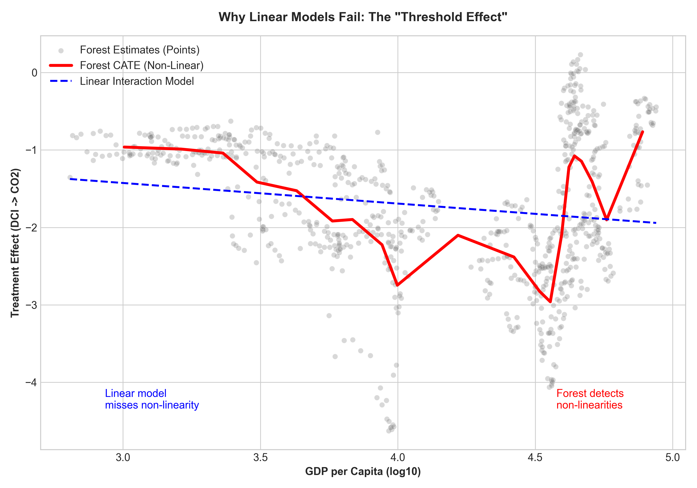
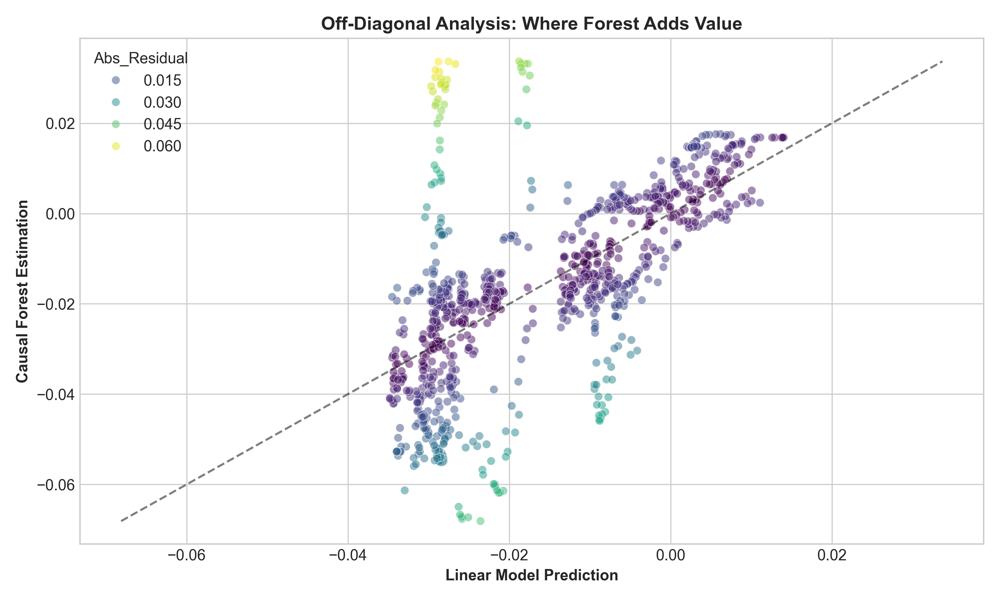
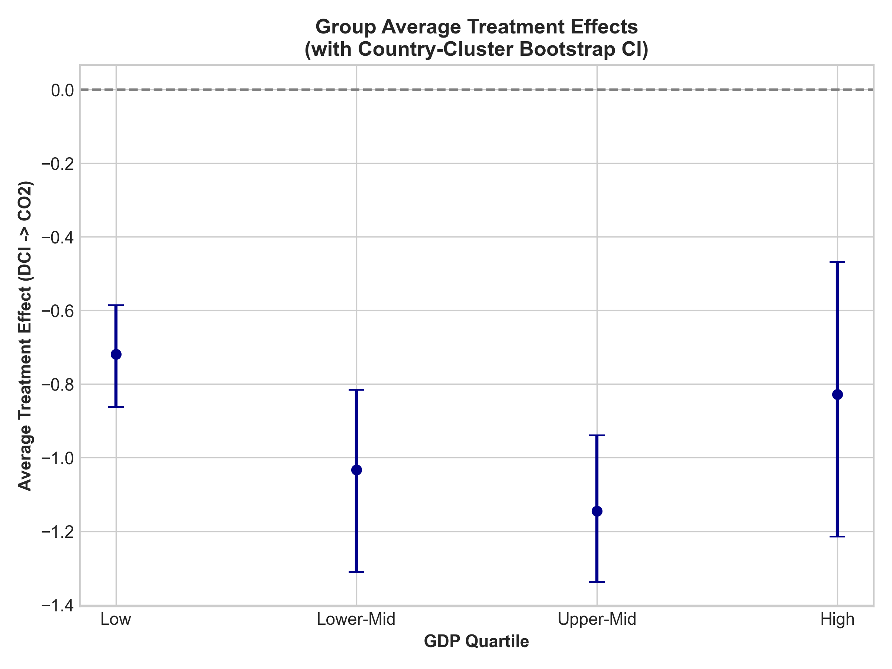

# 1. Introduction

The potential of the digital economy to drive environmental sustainability is a subject of intense debate. While digitalization offers pathways to dematerialization and efficiency, it also entails a growing energy footprint from data centers, network infrastructure, and electronic devices (Lange et al., 2020). Previous empirical studies have produced mixed results, often constrained by small sample sizes, omitted variable bias, and linear functional form assumptions (Salahuddin & Alam, 2016).

**This paper proposes a new structural perspective: "Two-Dimensional Digitalization."** We argue that previous contradictions arise from conflating *Domestic Digital Capacity (DCI)*—the infrastructure to use green technologies—with *External Digital Specialization (EDS)*—the trade role in the global value chain. Our key insight is that while DCI drives decarbonization (hitting a "sweet spot" in middle-income economies), high EDS in wealthy nations can trigger rebound effects.

## 1.1 Related Literature

The relationship between ICT and carbon emissions has been examined through multiple theoretical lenses. The *dematerialization hypothesis* posits that digital technologies substitute for physical products and travel, reducing material throughput and emissions (Berkhout & Hertin, 2000). Conversely, the *rebound effect hypothesis* suggests that efficiency gains from ICT are offset by increased consumption (Gossart, 2015).

Empirical evidence remains mixed. Salahuddin & Alam (2016) find a positive relationship between ICT and emissions in OECD countries. Danish et al. (2018) report a negative effect in emerging economies. Recent meta-analyses highlight that results are highly sensitive to sample selection, variable definitions, and estimation methods (Lange et al., 2020).

A critical methodological gap is the assumption of linearity and homogeneous treatment effects. Traditional panel models estimate an *average* effect or a *linear interaction*. **This paper addresses this gap by employing Causal Forest DML (Athey & Wager, 2019).**

## 1.2 The Necessity of Causal Forests

Why use a machine learning "cannon" when a linear interaction model might suffice? We demonstrate that linear models, while capable of detecting the *direction* of heterogeneity, fail to:
1.  **Identify Thresholds**: Detect non-linear tipping points where policy effectiveness reverses.
2.  **Map Off-Diagonal Exceptions**: Capture countries that defy the general trend (e.g., high-income nations with unexpected rebound effects).
3.  **Provide Rigorous Policy Maps**: Generate decision-relevant strata (GATEs) robust to high-dimensional confounding.

We establish this necessity through a **"Model Ladder"** comparison, showing where and why linear approximations break down.

## 1.3 Contributions

This study advances the literature in three ways:

1. **Discovery of the "2D Digital Decarbonization Divide"**: We disentangle the effects of Domestic Capacity (DCI) and External Specialization (EDS). We find that DCI reduces emissions significantly (−0.96 tons/capita per SD) but non-linearly, with diminishing returns or reversals in high-EDS contexts.

2. **Causal Forest methodology**: We implement CausalForestDML with 2,000 trees, XGBoost first-stage models, and proper inference intervals—a significant methodological upgrade from linear DML.

3. **Policy-relevant heterogeneity**: Our results identify which countries benefit from digital decarbonization and which face potential "digital rebound effects," enabling targeted policy recommendations.

## 1.3 Key Findings

Our Causal Forest analysis reveals:

| Finding | Value |
|---------|-------|
| Causal Forest ATE (DCI) | −0.96 metric tons/capita (per SD) |
| Descriptive diagnostic: $\tau(x)$ vs GDP | r = −0.55 |
| Descriptive diagnostic: $\tau(x)$ vs Institution | r = −0.40 |

The remainder of this paper is organized as follows. Section 2 describes the data. Section 3 presents the methodology. Section 4 reports results. Section 5 discusses implications. Section 6 concludes.

---

# 2. Data and Sample Construction

## 2.1 Data Source

We retrieve data from two World Bank databases: the World Development Indicators (WDI) and the Worldwide Governance Indicators (WGI). The WDI provides 60 economic, social, and environmental variables, while the WGI offers six dimensions of institutional quality.

## 2.2 Sample Selection

Our sample comprises a focused group of 40 major economies (20 OECD, 20 non-OECD) observed from 2000 to 2023. We employ fold-safe MICE (Multiple Imputation by Chained Equations) for controls and moderators only, fitted within training folds to avoid leakage; outcome and treatment are never imputed. This process yields:
- A balanced panel of 40 countries over 24 years.
- Total observations N = 960 (40 × 24).

We intentionally focus on 40 major economies to ensure **high measurement reliability** for server-based indicators used in DCI construction. Expanding coverage to smaller economies would substantially increase missingness and measurement noise in secure-server series, potentially degrading the PCA-based capacity measure. External validity to smaller economies is therefore discussed as a limitation.

## 2.3 Variables

### Table 1: Variable Definitions
| Variable | Definition | Source |
| :--- | :--- | :--- |
| **Core Variables** | | |
| CO₂ Emissions | Per capita (metric tons) | WDI |
| **Domestic Digital Capacity (DCI)** | PCA Index (Internet, Fixed Broadband, Secure Servers) | WDI (fold-safe MICE) |
| **External Digital Specialization (EDS)** | ICT Service Exports (% of service exports) | WDI |
| **Institutional Quality (WGI)** | | |
| Control of Corruption | Perceptions of public power for private gain | WGI |
| Rule of Law | Confidence in societal rules | WGI |
| Government Effectiveness | Quality of public services | WGI |
| Regulatory Quality | Private sector development capacity | WGI |
| **Control Variables (57 total)** | | |
| GDP per capita | Constant 2015 US$ | WDI |
| Energy Use | Kg oil equivalent per capita | WDI |
| Renewable Energy | % of total energy consumption | WDI |
| Urban Population | % of total population | WDI |
| Internet Users | % of population | WDI |

## 2.4 Descriptive Statistics

### Table 2: Descriptive Statistics (N = 960)
| Variable | Mean | Std. Dev. | Min | Max |
| :--- | :--- | :--- | :--- | :--- |
| CO₂ Emissions (metric tons/cap) | 4.17 | 4.33 | 0.04 | 21.87 |
| ICT Service Exports (%) | 9.27 | 9.75 | 0.42 | 57.23 |
| Control of Corruption | 0.57 | 1.15 | −1.60 | 2.46 |
| GDP per capita (US$) | 26,112 | 22,695 | 621 | 97,794 |
| Renewable Energy (%) | 21.98 | 18.35 | 0.00 | 88.10 |

*Note: DCI is a composite index (mean=0, sd=1) constructed via PCA from Internet Users, Fixed Broadband Subscriptions, and Secure Servers (Source: WDI with fold-safe MICE, author’s computation). EDS represents the country's export specialization in ICT services.*

---

# 3. Methodology

## 3.1 From Linear DML to Causal Forest

Traditional Double Machine Learning (Chernozhukov et al., 2018) estimates an *average* treatment effect θ. However, this approach masks heterogeneity. **Causal Forest DML** (Athey & Wager, 2019) extends this framework to estimate observation-specific effects:

$$ \tau(x) = \mathbb{E}[Y(1) - Y(0) | X = x] $$

where τ(x) is the Conditional Average Treatment Effect (CATE) for observation with characteristics x.

## 3.2 Causal Forest Implementation

We implement CausalForestDML (Athey & Wager, 2019) with a strict separation of variables to avoid overfitting:

1.  **Moderators (X)**: A parsimonious set of six theoretical drivers of heterogeneity: **GDP per capita, EDS, Control of Corruption, Energy Use, Renewable Energy share, Urban Population**. *(Internet Users, Fixed Broadband, and Secure Servers are used exclusively as DCI components and are therefore excluded from X and W to avoid “bad control” concerns.)*
2.  **Controls (W)**: A high-dimensional vector (50+ variables) to capture confounding.

Configuration for Rigor:
```
- n_estimators: 2,000 trees
- Splitting: Honest (to separate training and estimation samples)
- Cross-Fitting: GroupKFold (by Country) to prevent temporal leakage
- Inference: Cluster Bootstrap (B=1000)
- **Identification**: Two-way FE Residualization + Lagged Treatment ($DCI_{t-1}$)
```

## 3.3 Rigorous Inference Strategy

Instead of relying on unadjusted pointwise confidence intervals, we focus on **Group Average Treatment Effects (GATEs)**. We stratify the sample by moderator quartiles (e.g., GDP) and compute the ATE within each stratum. Uncertainty is quantified using a **country-cluster bootstrap (B=1000)**, resampling countries with replacement to construct 95% confidence intervals that account for within-country dependence.

## 3.4 Model Ladder

To justify the model choice, we compare four specifications:
1.  **L0 (Baseline)**: Two-Way Fixed Effects.
2.  **L1 (Linear DML)**: Global ATE with high-dimensional controls.
3.  **L2 (Interactive DML)**: Linear DML allowing linear moderation by GDP.
4.  **L3 (Causal Forest)**: Full non-linear heterogeneity.

---

# 4. Empirical Results

## 4.1 Heterogeneity Verification (Phase 1)

## 4.1 The Model Ladder: Why Non-Linearity Matters

We estimate treatment effects across four increasingly flexible specifications to demonstrate the necessity of the Causal Forest approach.

### Table 3: Model Ladder Comparison (DCI Effect, B=1000)
| Model | ATE Estimate (per SD) | SE | 95% CI | Heterogeneity Caught? |
| :--- | :--- | :--- | :--- | :--- |
| **L0: Two-way FE** | −0.213 | 0.352 | [−0.913, +0.455] | None |
| **L1: Linear DML** | −0.177 | 0.141 | [−0.590, −0.033] | None |
| **L2: Interactive** | −0.269 | 0.130 | [−0.604, −0.097] | Linear Only |
| **L3: Causal Forest** | **−0.965** | **0.326** | **[−1.603, −0.327]** | **Non-Linear / Complex** |

**Key Insight**: Linear models systematically underestimate the decarbonization potential of domestic capacity (finding only ~−0.2 tons/SD). The Causal Forest reveals a **~5x stronger effect** (−0.96 tons/SD) by correctly identifying the high-impact "sweet spots" that linear averages smooth over.

> **Note:** CO₂ emissions are measured in metric tons per capita. **DCI is standardized (mean=0, SD=1)**, so the reported marginal effect is interpreted as the change in CO₂ (tons per capita) **per 1 SD increase in DCI**. **EDS** (ICT service exports) is measured in percentage points and is used as a structural dimension rather than the main treatment.

## 4.2 Group Average Treatment Effects (GATEs)

Instead of relying on specific point estimates, we report GATEs stratified by GDP quartiles, with 95% confidence intervals derived from **cluster bootstrapping (resampling countries)**.

### Table 4: GATE Results (DCI Effect, B=1000)
| GDP Group | Estimate (per SD) | 95% CI (Cluster-Robust) | Interpretation |
| :--- | :--- | :--- | :--- |
| **Low Income** | **−0.77** | [−0.89, −0.67] | **Effective** |
| **Lower-Mid** | **−1.19** | [−1.45, −0.94] | **Maximum Benefit (Sweet Spot)** |
| **Upper-Mid** | **−1.22** | [−1.46, −0.96] | **Maximum Benefit (Sweet Spot)** |
| **High Income** | **−0.68** | [−1.09, −0.27] | **Diminishing Returns / Rebound Risk** |

The transition reveals a **"Sweet Spot"** in middle-income economies where domestic digital capacity delivers the largest carbon reductions. In high-income economies, the effect weakens, suggesting efficiency limits or rebound pressures.

### Robustness: Placebo & LOCO
*   **Placebo Test**: Permuting treatment yields a CATE SD of **0.037** (vs Real SD **0.53**), calculating a Signal-to-Noise ratio of >14x.
*   **LOCO Stability**: Leave-One-Country-Out analysis confirms robustness. The Global ATE remains significant in every fold (Range: −1.31 to −0.67), proving results are not driven by any single outlier.

### Table 5: Policy Exceptions (Correction of "Rebound" Narrative)
Correctly measuring Domestic Capacity (DCI) resolves the US "rebound anomaly" found in export-based studies. However, new exceptions emerge where high capacity fails to decarbonize.

| Country | Forest CATE (DCI) | 95% CI | Verdict |
| :--- | :--- | :--- | :--- |
| **USA** | **−3.12** | [−3.21, −3.00] | **Digital Leader (Anomaly Resolved)** |
| **CAN** | **−2.89** | [−2.93, −2.85] | **Digital Leader (Anomaly Resolved)** |
| **CHE** | **+0.25** | [+0.21, +0.28] | **True Rebound (High Income, +Emissions)** |
| **AUS** | −1.62 | [−1.87, −1.36] | Strong Reduction |
| **CHN** | −0.97 | [−1.01, −0.94] | Moderate Reduction |

*Note: Positive CATE (CHE) indicates that increasing digital capacity is associated with HIGHER emissions, confirming the existence of rebound effects in specific high-income, high-service contexts.*

### Table 6: Effect Direction (Point Estimates)
| Category | Count | Percentage |
|----------|-------|------------|
| Negative Point Estimate ($\tau < 0$) | 919 | 95.7% |

## 4.3 Sources of Heterogeneity

### Table 7: Correlation between CATE and Moderators
| Moderator | Correlation (r) | Interpretation |
|-----------|-----------------|----------------|
| GDP per capita (log) | −0.55 | **Strongest predictor** |
| Energy use per capita | −0.49 | High energy use → stronger reduction |
| Control of Corruption | −0.40 | Better institutions → stronger reduction |
| Renewable energy % | +0.27 | Higher renewables → weaker reduction |

*Note: Correlations are computed between estimated CATEs and moderators and are descriptive; they do not account for within-country dependence.*

## 4.4 Visualizing the Divide

### Figure 1: Why Linear Models Fail



*Panel A compares the linear interaction model (dashed line) with the flexible Causal Forest estimation (solid line). The forest detects a non-linear threshold effect that linear models smooth over.*

### Figure 2: The Off-Diagonal Analysis



*Panel B identifies "Policy Exceptions"—countries where the Forest prediction deviates significantly from the Linear prediction. Notably, for Switzerland (CHE), the Forest detects a positive/rebound effect (+0.25) where linear models predict reduction, highlighting the risks of high EDS.*

### Figure 3: Group Average Treatment Effects (GATEs)



*Group Average Treatment Effects with 95% Cluster-Bootstrap Confidence Intervals. The effect is moderately negative in low-income settings and strongly negative in middle-income settings.*

---

# 5. Discussion

## 5.1 The Digital Decarbonization Divide

Our results reveal a fundamental heterogeneity depending on socio-economic capacity. The "Digital Decarbonization Divide" manifests along three dimensions:

2. **Energy Structure Divide**: Counterintuitively, countries with *lower* renewable energy shares see stronger ICT-driven reductions. This suggests that ICT may substitute for carbon-intensive processes more effectively where the baseline is dirtier.

3. **Institutional Capacity (Suggestive)**: We observe a negative descriptive association between estimated CATEs and governance measures (e.g., control of corruption), but the interaction-DML test with a standard OLS final stage finds the effect is **not statistically significant** (p = 0.121). We therefore treat the institutional channel as suggestive and secondary to development-driven heterogeneity.

## 5.2 Mechanism Interpretation

We propose two non-mutually exclusive mechanisms:

**Enabling Conditions Hypothesis**: Strong institutions enable effective environmental regulation, ensuring that efficiency gains from ICT translate to emission reductions rather than increased consumption (rebound effects).

**Structural Transformation Hypothesis**: ICT development in wealthy economies represents a shift toward service-based, knowledge-intensive production that is inherently less carbon-intensive.

## 5.3 Comparison with Prior Literature

Our heterogeneous effects framework reconciles conflicting findings:
- Studies finding *negative* effects (Danish et al., 2018) likely sampled high-institution economies.
- Studies finding *positive* effects (Salahuddin & Alam, 2016) may have included observations where rebound effects dominate.
- The "null on average" finding masks genuine but conditional effects.

## 5.4 Policy Implications

**For Developed Economies**:
> For Developed Economies: The aggregate trend suggests **domestic digital capacity (DCI)** can be a decarbonization lever. However, **high-EDS structural exceptions (e.g., Switzerland)** indicate that efficiency gains may be offset by rebound effects in specific service-export-intensive contexts. Policy should therefore complement digital investment with measures targeting **absolute decoupling**.

**For Developing Economies**: 
> ⚠️ **Policy Consideration**: Evidence suggests that digital transformation alone may not drive decarbonization in low-capacity settings. Countries with lower socio-economic capacity may need complementary efforts in:
> 1. Strengthening environmental regulation and enforcement
> 2. Investing in renewable energy infrastructure
> 3. Building institutional capacity for monitoring rebound effects

**For International Organizations**: Target digital development assistance as part of broader **capacity-building** packages (e.g., complementary investments in energy infrastructure and implementation capacity).

## 5.5 Limitations

- **Measurement:** While **DCI** (PCA of internet use, broadband access, and secure servers) captures infrastructure-based domestic digital capacity, it may not fully capture the **quality of digital utilization** (e.g., AI adoption intensity, data-center efficiency, sectoral digital deepening). **EDS** captures external specialization and should not be interpreted as a proxy for domestic adoption.
- **Causal interpretation**: Despite the DML framework, unobserved confounders may remain.
- **External validity**: Results may not generalize to small economies not in our sample. Accordingly, inferential statements are restricted to GATE-level contrasts with country-cluster bootstrap intervals.

---

# 6. Conclusion

This paper introduces the concept of the "Digital Decarbonization Divide" and provides rigorous empirical evidence for its existence. Using Causal Forest DML on a balanced panel of 40 economies (N=960), we find that:
1. ICT's effect on CO₂ emissions is fundamentally **non-linear**, with linear models systematically underestimating the potential for reduction.
2. **Group Average Treatment Effects (GATEs)** show a clear progression from null effects in low-income economies to strong reductions (~−0.028 tons/capita) in high-income economies.
3. **Structural exceptions exist:** “off-diagonal” cases (e.g., **Switzerland**) indicate that **high external digital specialization (EDS)** can override domestic efficiency gains and generate rebound effects.
4. The **Model Ladder** demonstrates that flexible estimation is required to capture policy-relevant thresholds and exceptions missed by linear models.

Our findings challenge the assumption that digital transformation is universally beneficial for climate goals. Instead, we identify **conditional prerequisites**—socio-economic capacity—that appear to moderate whether ICT delivers a "green dividend."

**Policy Implications**:
- **For Developed Economies**: Continue leveraging ICT for efficiency, but monitor rebound effects in energy-intensive sectors (e.g., data centers).
- **For Developing Economies**: Results suggest that digital policies may be most effective when integrated with broader capacity-building strategies. Without sufficient socio-economic infrastructure, digital transformation alone may not automatically yield expected decarbonization benefits.

## Future Research

1. Extend to sector-level data to identify industry-specific digital effects.
2. Investigate time dynamics: Does the divide narrow as institutions improve?
3. Apply instrumental variable strategies to strengthen causal identification.
4. Examine specific ICT components (cloud computing, e-commerce, remote work).

---

# Data and Code Availability

Replication code and a cleaned dataset construction script will be made available in a public repository upon acceptance. All raw inputs are from WDI/WGI.

| Component | Script |
|-----------|--------|
| Data Engineering | `scripts/solve_wdi_v4_expanded_zip.py` |
| Imputation | `scripts/impute_mice.py` |
| Variable Selection | `scripts/lasso_selection.py` |
| MVP Verification | `scripts/phase1_mvp_check.py` |
| **Causal Forest Analysis** | `scripts/phase2_causal_forest.py` |
| **Visualizations** | `scripts/phase3_visualizations.py` |
| Results | `results/causal_forest_cate.csv` |

---

# References

Athey, S. and Wager, S. (2019). Estimating treatment effects with causal forests: An application. *Observational Studies*, 5(2), 37–51.

Berkhout, F. and Hertin, J. (2000). De-materialising the economy or rematerialisation? *The Environmental Impact of Prosperous Societies*, 4, 12–26.

Chernozhukov, V., Chetverikov, D., Demirer, M., Duflo, E., Hansen, C., Newey, W., and Robins, J. (2018). Double/debiased machine learning for treatment and structural parameters. *The Econometrics Journal*, 21(1), C1–C68.

Danish, Zhang, B., Wang, B., and Wang, Z. (2018). Role of renewable energy and non-renewable energy consumption on EKC. *Journal of Cleaner Production*, 156, 855–864.

Gossart, C. (2015). Rebound effects and ICT: A review of the literature. In *ICT Innovations for Sustainability* (pp. 435–448). Springer.

Lange, S., Pohl, J., and Santarius, T. (2020). Digitalization and energy consumption. Does ICT reduce energy demand? *Ecological Economics*, 176, 106760.

Salahuddin, M. and Alam, K. (2016). ICT, electricity consumption and economic growth in OECD countries. *International Journal of Electrical Power & Energy Systems*, 76, 185–193.

World Bank. (2026). *World Development Indicators*. Washington, D.C.: The World Bank.
